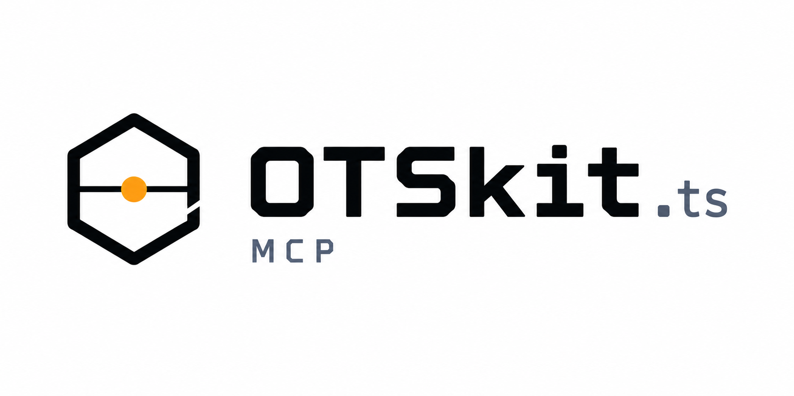

<p align="center">
  
</p>

# @otskit/mcp

OpenTimestamps MCP server — stamp, upgrade, and verify timestamps via AI agents (Claude).

## Installation

```bash
pnpm install
pnpm build
```

## Usage

```bash
ots-mcp
```

## Dependencies

- [`@otskit/core`](../otskit-core) — OpenTimestamps core logic
- [`@otskit/client`](../otskit-client) — OTS client
- [`@modelcontextprotocol/sdk`](https://github.com/modelcontextprotocol/typescript-sdk) — MCP SDK
- `better-sqlite3` — local database
- `archiver` — ZIP support

## Development

```bash
pnpm dev       # watch mode
pnpm test      # run tests
pnpm build     # production build
```
